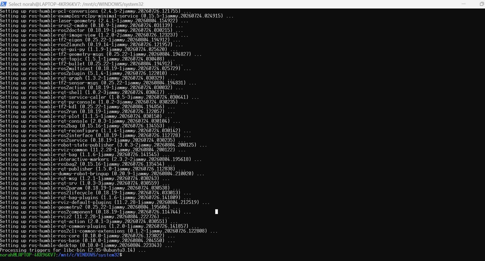

# Installing and Running ROS 2 Humble on WSL (Ubuntu 22.04)

## Overview
This project documents installing a Linux system (Ubuntu 22.04 via WSL on
Windows) and setting up **ROS 2 Humble**, including the steps taken, the
issue encountered during installation, and how it was resolved.

## Steps

### 1. Installing WSL
- Checked whether WSL was already installed using:
  ```
  wsl --list --verbose
  ```
- It was not installed, so WSL was enabled first (without a default
  distribution):
  ```
  wsl --install --no-distribution
  ```
- Restarted the computer to activate the required Windows features
  (Virtual Machine Platform).

### 2. Installing Ubuntu 22.04
- After restarting, Ubuntu 22.04 was installed specifically (to match the
  ROS 2 Humble requirement) using:
  ```
  wsl --install -d Ubuntu-22.04
  ```
- Created a Linux user account during first launch.

### 3. Updating the system
```bash
sudo apt update && sudo apt upgrade -y
```

### 4. Installing ROS 2 Humble
Following the official ROS 2 installation steps:
```bash
sudo apt install software-properties-common curl -y
sudo curl -sSL https://raw.githubusercontent.com/ros/rosdistro/master/ros.key -o /usr/share/keyrings/ros-archive-keyring.gpg
echo "deb [arch=amd64 signed-by=/usr/share/keyrings/ros-archive-keyring.gpg] http://packages.ros.org/ros2/ubuntu jammy main" | sudo tee /etc/apt/sources.list.d/ros2.list > /dev/null
sudo apt update
sudo apt install ros-humble-desktop -y

The screenshot below shows the installation completing successfully:


```

### 5. Running ROS 2
```bash
echo "source /opt/ros/humble/setup.bash" >> ~/.bashrc
source ~/.bashrc
ros2 --version
echo $ROS_DISTRO
```

## Issue Encountered

While typing the `sudo apt update && sudo apt upgrade -y` command, an issue
occurred with pasting into the terminal (Windows Terminal running WSL).
Copy-paste using `Ctrl+V` did not work as expected, which caused two
commands to run together on the same line without a proper separator
(`-ysudo curl...`). This produced the following error:

```
E: Option curl: Configuration item specification must have an =<val>.
```

**Fix:** The commands were re-entered separately, and pasting was done
using **Shift + Insert** instead of `Ctrl+V`, which resolved the issue.
Each command was re-run individually and completed successfully.

## Output

The following screenshot shows the result of running `ros2 --version` and
`echo $ROS_DISTRO`, confirming ROS 2 Humble was installed and sourced
correctly:


## Tools Used
- Windows Subsystem for Linux (WSL2)
- Ubuntu 22.04 LTS
- ROS 2 Humble
